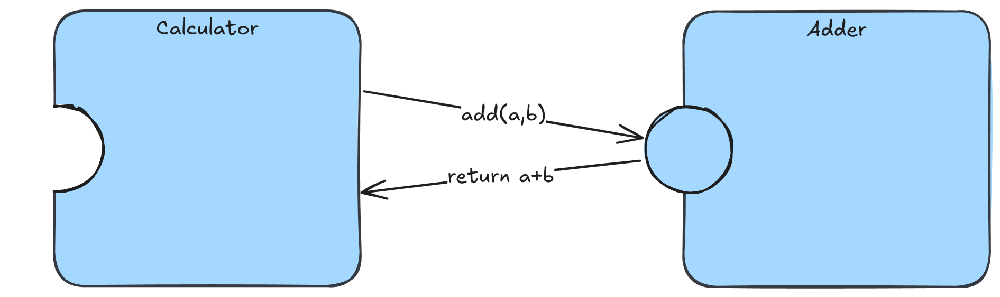

# The Component Model

> This directory provides a DevBox environment. Run `devbox shell` to have all the tools required to
> execute the commands listed here and in subdirectories.

## What is a Component

Components can be seen as self-describing units of executable code, with clearly defined interfaces.
Through these interfaces, components can be composed with one another the same way a program might
use a library in regular programming languages.

In the comparison between the JVM and WASM, components can be seen as similar to JARs in that they
serve as self-contained packages. They can be produced from various languages (just like JARs can be
produced by different languages like Java or Scala) and have an interface they adhere to. As opposed
to JARs, this interface is fully described, and of course, the security guarantees from WASM still
hold.

## Composition

The power of the component model lies in the ability to enable safe, efficient and language-agnostic
composition as plug-and-play building blocks, just like program libraries can be combined into a
program.


The interfaces over which these components talk is implemented in WASM, but are described in the
Wasm Interface Type (WIT) language. This is a human readable way to define what interface the
component wants to use (imports) and which interface the component provides (exports).

### Example Overview

In our example we will compose two simple components, one that provides a function to add two
unsigned integers, while the other uses that functionality to trigger a computation. You can find
the structure of these components under [py-component](./py-component/) (adder) and
[rs-component](./rs-component/) (calculator). This tutorial will guide you through the missing parts
to make this a working showcase of the component-model!



Check out the [WIT definition](./py-component/wit/component.wit) of the `adder` component and try to
define the interface that exports an `add` function.

> **💡Note:** Interfaces are collected under `Worlds` that can describe the capabilities of a
> component.

<details>
    <summary>Solution</summary>

```wit
package wasmcloud-tutorial:adder@0.1.0;

interface add {
    add: func(x: u32, y: u32) -> u32;
}

world adder {
    export add;
}
```

</details>

With the `WIT` we define a versioned package, which contains a single interface definition. As
implemented above the `adder` world exports the `add` interface. On the other side, implement the
[WIT definition](./rs-component/wit/component.wit) of the `calculator` component to import the `add`
function of the `adder` component.

> **💡Note:** As we do not export any functionality we can omit a version for this package.

<details>
    <summary>Solution</summary>

```wit
package wasmcloud-tutorial:calculator;

world app {
    import wasmcloud-tutorial:adder/add@0.1.0;
}
```

</details>

The beauty of these definitions is that the implementation of these components can now be performed
in any language which targets WebAssembly. In our case we will implement the `adder` component with
Python, and the `calculator` in Rust.

## A Python Component

As mentioned above the structure of a Python component can be found under
[`py-component`](./py-component/). For which we earlier implemented the `add` interface. Check out
its README on how to complete the missing parts and build the component. Once you successfully built
the component and aquired the `adder.wasm` file come back and continue with the `calculator`
component below.

## A Rust Component

For the `calculator` component you will find the structure of a Rust component under
[`rs-component`](./rs-component/). This will use the Python component and return an executable
component that performs an arithmetic operation. Check out its README on how to complete the missing
parts and build the component. Like before once you built the component and got the
`calculator.wasm` file come back and learn how to compose the two components together!

## Composing

Now before we can run the components, we need to compose them. This can be done using the `wac`
(WebAssembly Composition) tooling:

```sh
wac plug ./rs-component/target/wasm32-wasip1/release/calculator.wasm --plug ./py-component/adder.wasm -o final.wasm
```

This plugs the two components together into a final WebAssembly module that can be run:

```sh
wasmtime run ./final.wasm
```

You just ran a WebAssembly payload which was compiled from a part Python and a part Rust. We could
just as well also add some C, C#, JavaScript, or Go code to the mix!

Understanding this component composition and the WIT is fundamental to understanding wasmCloud.
