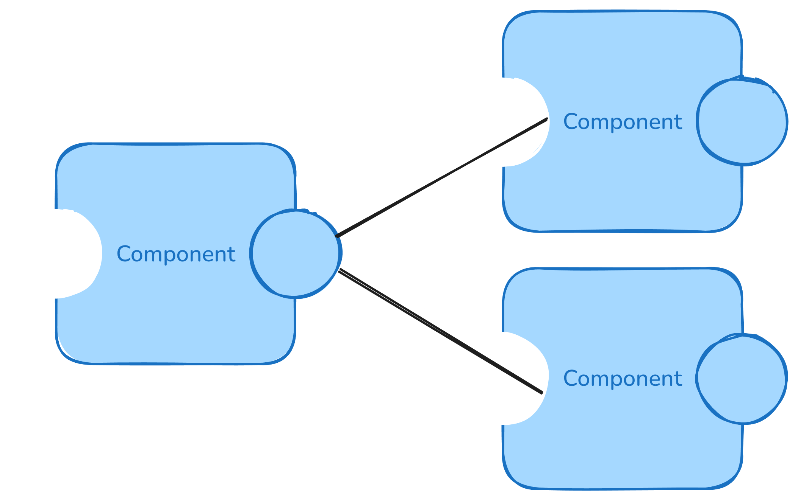

# The Component Model

> This directory provides a DevBox environment. Run `devbox shell` to have all the tools required to
> execute the commands listed here and in subdirectories.

## What is a Component

Components can be seen as self-describing units of executable code, with clearly defined interfaces.
Through these interfaces, components can be composed with one another the same way a program might
use a library in regular programming languages.

In the comparison between the JVM and WASM, components can be seen as similar to JARs. They can be
produced from various languages (just like JARs can be produced by different languages like Java or
Scala) and have an interface they adhere to. As opposed to JARs, this interface is fully described,
and of course, the security guarantees from WASM still hold.

## Composition

The power of the component model comes from the fact that these components can be composed, just
like program libraries can be combined into a program.



The interfaces over which these components talk is implemented in WASM, but are described the Wasm
Interface Type (WIT) language. This is a human readable way to define what interface the component
wants to use (imports) and which interface the component provides (exports).

For instance, in this example we will compose two simple components, one that provides a function to
add two unsigned integers, while the other uses that functionality to trigger a computation. Check
out the WIT definition of the former component:

```wit
package wasmcloud-tutorial:adder@0.1.0;

interface add {
    add: func(x: u32, y: u32) -> u32;
}

world adder {
    export add;
}
```

This defines a versioned package, which contains a single interface definition. The `adder` world
then exports the `add` interface. On the other side, check out the second component's WIT:

```wit
package wasmcloud-tutorial:calculator;

world app {
    import wasmcloud-tutorial:adder/add@0.1.0;
}
```

This defines an unversioned package (versioning is not as important here as it does not export any
functionality), which imports the `add` interface from the `wasmcloud-tutorial:adder` package
described in the former WIT definition.

> Worlds are just collections of interfaces that can describe the capabilities of a component.

The beauty of these definitions is that the implementation of these components can now be performed
in any language which targets WebAssembly. In our case we will implement the `adder` component with
Python, and the other one in Rust.

## A Python Component

You will find a Python component under [`py-component`](./py-component/). This will implement the
`add` interface described above. Check out its README on how to build the component.

If you ran the two `componentize-py` commands, you should have a `adder.wasm` component in the
`py-component` directory.

## A Rust Component

You will find a Rust component under [`rs-component`](./rs-component/). This will use the Python
component and return an executable component that performs an arithmetic operation. Check out its
README on how to build the component.

If you ran the two `cargo` commands, you should have a `calculator.wasm` component in the
`rs-component/target/wasm32-wasip1/release/` directory.

## Composing

Now before we can run the components, we need to compose them. This can be done using the `wac`
(WebAssembly Composition) tooling:

```sh
wac plug ./rs-component/target/wasm32-wasip1/release/calculator.wasm --plug ./py-component/adder.wasm -o final.wasm
```

This plugs the two components together into a final WebAssembly module that can be run:

```sh
wasmtime run ./final.wasm
```

You just ran a WebAssembly payload which was compiled from a part Python and a part Rust. We could
just as well also add some C, C#, JavaScript, or Go code to the mix!

Understanding this component composition and the WIT is fundamental to understanding wasmCloud.
