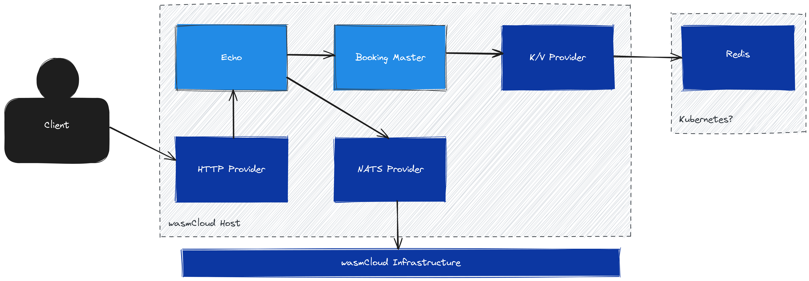

# Components

We are developing an application that consists of several components, which are all linked together
via WIT imports/exports. This directory contains the implementation of the individual components.

## Architecture



## Local Testing

In each component directory, run a `wash build`, this should generate the WASM modules required to
run. Once these exist, launch a local version of wasmCloud:

```sh
wash up -d
```

Then, we need a Redis instance to back our key/value provider. In order to do this, we will launch a
container:

```sh
docker run -d --rm --name redis -p 6379:6379 redis:8.2.1
```

Then deploy the application:

```sh
wash app deploy local.wadm.yaml
```

At this point, connect to your local NATS cluster to subscribe to the `bookings.events` subject:

```sh
nats -s 127.0.0.1:4222 sub "bookings.events"
```

Then you should be able to access the application under `localhost:8000`

```console
$ curl -X POST http://localhost:8000/1 -d '{"booking": "This is a simple booking"}'
Booking 1 created

$ curl http://localhost:8000/1
Booking 1: This is a simple booking
```

You should see a message being published:

```console
$ nats -s 127.0.0.1:4222 sub "bookings.events"
15:20:16 Subscribing on bookings.events
[#1] Received on "bookings.events"
Created booking 1: This is a simple booking


[#2] Received on "bookings.events"
Retrieved booking 1: This is a simple booking
```

Check that the bookings are truly present in Redis:

```sh
docker exec redis redis-cli get "1"
```

Finally, you can delete bookings:

```console
$ curl -X DELETE http://localhost:8000/1
Deleted booking 1
```

Which should also create a message on the event stream:

```console
[#3] Received on "bookings.events"
Deleted booking 1
```

Tear down the local wasmCloud instance:

```sh
wash down
docker stop redis
```

## Check Logs

```sh
cat ~/.wash/downloads/wasmcloud.log | grep demo.booking-master
cat ~/.wash/downloads/wasmcloud.log | grep demo.echo
```

## Deploying on Kubernetes

You can deploy the application on a Kubernetes hosted wasmCloud platform using the following
command. For a step by step guide on how to set this up, see [`../README.md`](../README.md).

```sh
kubectl apply -f k8s.wadm.yaml
```
